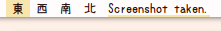

# polynotifications
Display notifications in your bar using tiramisu as the notification daemon.
Currently a work-in-progress. Multi-line notifications buggy at the moment.

## Setup
Install [tiramisu](https://github.com/Sweets/tiramisu) making sure `config.h` has JSON output enabled. 
```ini
$ git clone https://github.com/Sweets/tiramisu && cd tiramisu
$ make
$ sudo make install
```

Download polynotifications and make it executable.
```ini
$ cd ~/.config/polybar
$ git clone https://github.com/alnj/polynotifications && cd polynotifications
$ chmod +x polynotifications.sh
```

Create the polynotifications module in your polybar config and add it to your bar.
```ini
[bar/mybar]
modules-left = workspaces polynotifications

[module/polynotifications]
type = custom/script
# Change the path to where you downloaded polynotifications
exec = ~/.config/polybar/polynotifications/polynotifications.sh
format = <label>
label-padding = 1
tail = true
```

**If you are using another notification daemon such as dunst you must kill it as only one notification daemon can be active.** `pkill dunst`

Check out the top of `polynotifications.sh` for some settings.

Feel free to open an issue with feature requests or bugs.

## TODO

* If possible, implement ability to scroll through notification history
* Fix multi-line notifications having skipped lines when `$keep_last` is unset
* Split notifications into lines instead of truncating them
* Add formatting options
